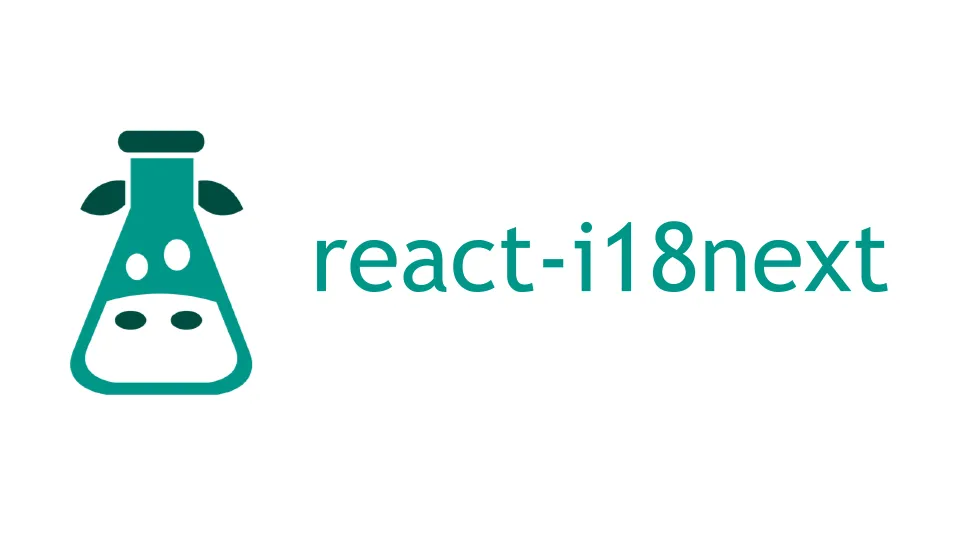

    
    <h1> React-TypeScript Internationalization app </h1>

This repository was created with the intention of providing developers with a
guide for creating scalable, multilingual applications with features like
dynamic language switching, localized date and time formatting, and RTL support.
Ideal for developers looking to implement robust internationalization solutions
in their React projects.
